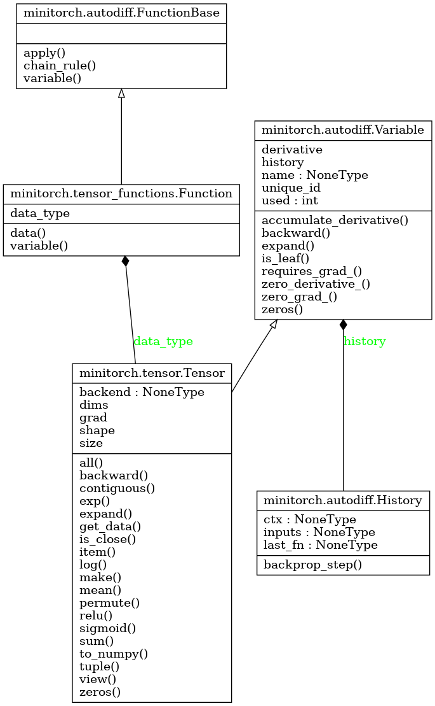

This repo implements a mini-version of the [Torch](http://www.pytorch.org) API (that is why I call it Matchstick, as opposed to a torch), based on the schema by [MiniTorch](http://minitorch.github.io).

This toy library demonstrates many internal concepts underlying deep learning systems.
Powered by [Pyreverse](https://pylint.pycqa.org/en/latest/pyreverse.html), the key UML diagram of Tensor Functions is shown as follows.

To get started, first read [setup](https://minitorch.github.io/install/) to build your workspace.

Implemented features:

- [x] GitHub CI 
- [x] Basic Neural Networks and Modules
- [x] Autodifferentiation for Scalars
- [x] Tensors, Views, and Strides
- [x] Parallel Tensor Operations
- [x] GPU / CUDA Programming in NUMBA
- [ ] Convolutions and Pooling
- [ ] Advanced NN Functions
